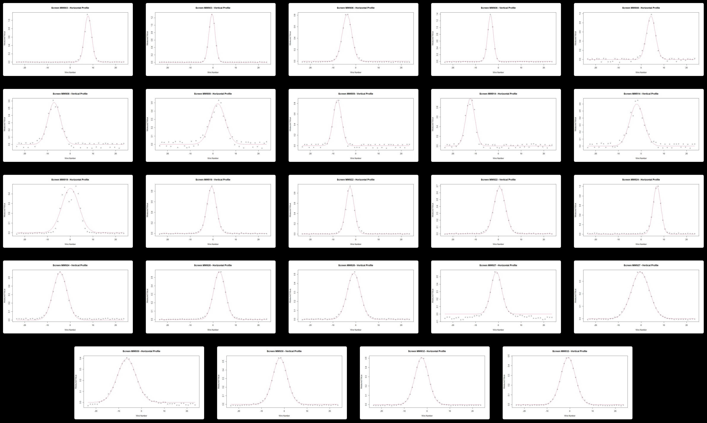
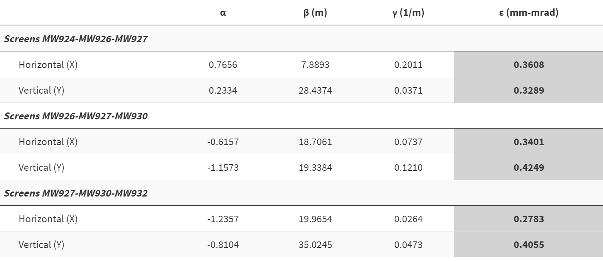
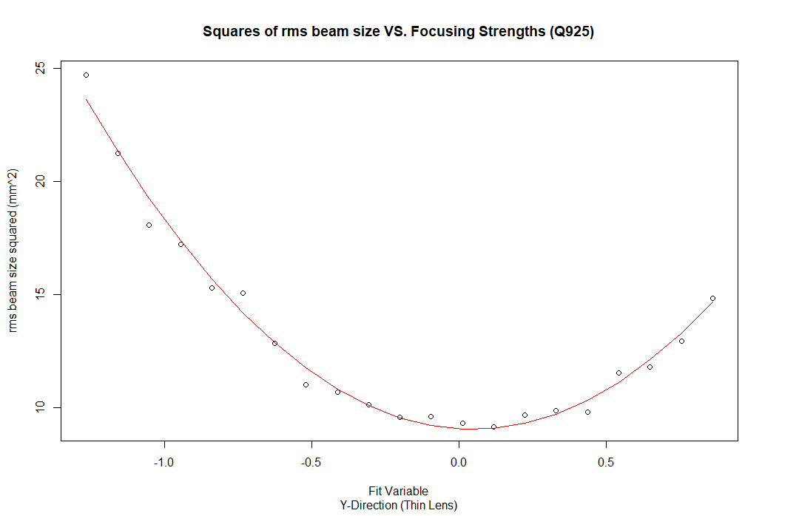
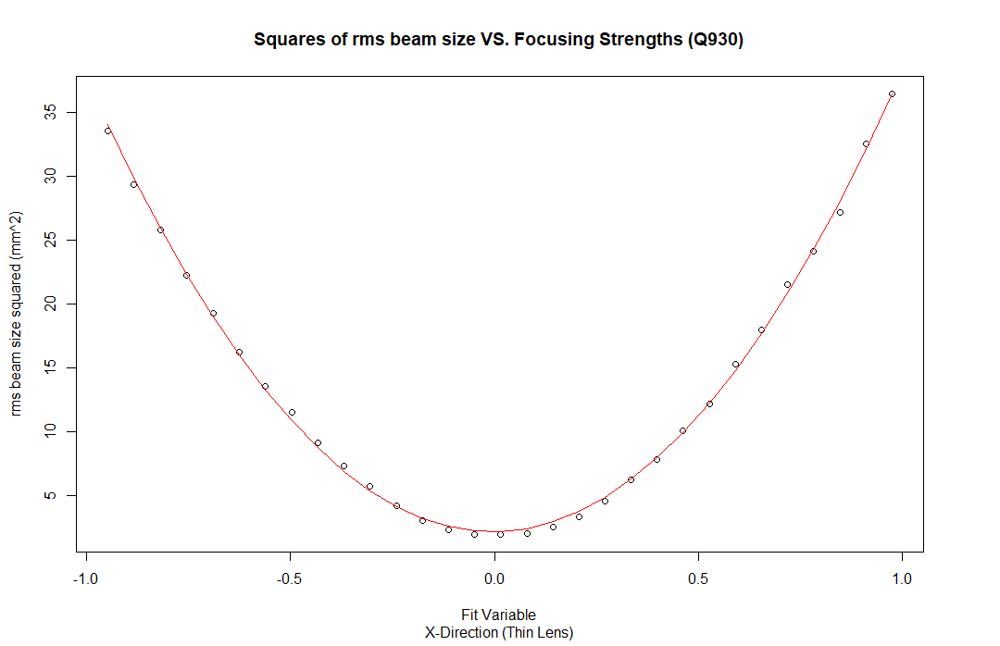

```{css, echo=FALSE}
.main-container {
    max-width: 1220px;
    margin-left: auto;
    margin-right: auto;
}

.columns {display: flex; flex-basis: auto}

body {
    font-family: "Open Sans","Helvetica Neue",Helvetica,Arial,sans-serif;
    font-size: 15px;
    line-height: 1.42857143;
    color: #666666;
    background-color: #ffffff;
}


```

```{css toc-content, include=FALSE}
#TOC {
#  left: 20px;
#  margin: 30px 0px 25px 0px;
#}


#div.main-container {
#    max-width: 3500px;
#    margin-left: -75px;
    #left: -100px;
#}
```

```{r setup, echo=FALSE, warning=FALSE, include=FALSE}
library(data.table)
library(dplyr)
library(ggplot2)
library(knitr)
library(kableExtra)
library(minpack.lm)
library(plotly)

```

```{r, echo=FALSE}
knitr::opts_chunk$set(error = TRUE)
load(".RData")
```

# Optics Studies for Commissioning the Main Extraction Line for Mu2e {.tabset .tabset-pills}

## First Optics Study {.tabset}

For a quick, rough comparison between the sigmas from the actual measurement data and the simulated sigmas from g4beamline, what follows are plots of the beam widths ($\sigma^2$) taken from each multiwire monitor in the M4line starting with MW903 and ending at MW932. The grey lines represent the locations of each monitor in the line. The "measured" line shows the data recorded at the actual optics study and the red dotted line, "simulated", represents the data taken from the g4beamline simulation.

### Base Beam (-background)

::: row
::: col-md-6
<center>

```{r echo=FALSE, warning=FALSE}
BaseBeamCompPlotX = ggplot() +
  geom_line(data = BBeamSG2S, aes(x=S, y=Square_Sigmas_X, color = "SigmaX Measured", linetype = "SigmaX Measured"), lwd = 1) + 
  geom_line(data = EXTCheckNN, aes(x=S, y=Sigma_X, color = "SigmaX Simulated", linetype = "SigmaX Simulated"), lwd = 1) +
  geom_rect(aes(xmin=13.52534,xmax=13.62534,ymin=0.0,ymax=15.0),color="#8F8F8F",fill="#8F8F8F",alpha = 0.75) +
  geom_rect(aes(xmin=24.85662,xmax=24.95662,ymin=0.0,ymax=15.0),color="#8F8F8F",fill="#8F8F8F",alpha = 0.75) +
  geom_rect(aes(xmin=36.90825,xmax=37.00825,ymin=0.0,ymax=15.0),color="#8F8F8F",fill="#8F8F8F",alpha = 0.75) +
  geom_rect(aes(xmin=40.80515,xmax=40.90515,ymin=0.0,ymax=15.0),color="#8F8F8F",fill="#8F8F8F",alpha = 0.75) +
  geom_rect(aes(xmin=59.75142,xmax=59.85142,ymin=0.0,ymax=15.0),color="#8F8F8F",fill="#8F8F8F",alpha = 0.75) +
  geom_rect(aes(xmin=81.03692,xmax=81.13692,ymin=0.0,ymax=15.0),color="#8F8F8F",fill="#8F8F8F",alpha = 0.75) +
  geom_rect(aes(xmin=94.72626,xmax=94.82626,ymin=0.0,ymax=15.0),color="#8F8F8F",fill="#8F8F8F",alpha = 0.75) +
  geom_rect(aes(xmin=107.0369,xmax=107.1369,ymin=0.0,ymax=15.0),color="#8F8F8F",fill="#8F8F8F",alpha = 0.75) +
  geom_rect(aes(xmin=114.2856,xmax=114.3856,ymin=0.0,ymax=15.0),color="#8F8F8F",fill="#8F8F8F",alpha = 0.75) +
  geom_rect(aes(xmin=120.3844,xmax=120.4844,ymin=0.0,ymax=15.0),color="#8F8F8F",fill="#8F8F8F",alpha = 0.75) +
  geom_rect(aes(xmin=144.2491,xmax=144.3491,ymin=0.0,ymax=15.0),color="#8F8F8F",fill="#8F8F8F",alpha = 0.75) +
  geom_rect(aes(xmin=166.7765,xmax=166.8765,ymin=0.0,ymax=15.0),color="#8F8F8F",fill="#8F8F8F",alpha = 0.75) +
  theme_bw() + labs(x = "S (m)", y = "Sigma X Squared (mm^2)", title = "Comparing Measured to Simulated Sigmas", color = "Variable", 
    linetype = "Variable", subtitle = "Real Screens Only") +
  theme(plot.title = element_text(face = "bold", size = 18, hjust = 0.5), legend.text = element_text(size = 8),
        legend.background = element_rect(fill = "white", size = 0.1, colour = "black"),
        legend.justification = c(0, 0.5), axis.title.y = element_text(),
        legend.position = "right", legend.title = element_blank(),
        plot.subtitle = element_text(hjust = 0.5, vjust=0, size = 14), axis.ticks = element_line(colour = "black", size = 1),
        panel.grid.minor = element_blank(), axis.title = element_text(size=10), 
        panel.border = element_rect(size = 1), panel.background = element_rect(fill = "#FAFAFA")) + 
  scale_color_manual(name="Variable", breaks = c("SigmaX Measured", "SigmaX Simulated"), values = colors) +
  scale_linetype_manual(breaks = c("SigmaX Measured", "SigmaX Simulated"), values = line)
BaseBeamCompPlotX
```

</center>
:::

::: col-md-6
<center>

```{r 1st Study Y, echo=FALSE, include=TRUE}
BaseBeamCompPlotY = ggplot() +
  geom_line(data = BBeamSG2S, aes(x=S, y=Square_Sigmas_Y, color = "SigmaY Measured", linetype = "SigmaY Measured"), lwd = 1) + 
  geom_line(data = EXTCheckNN, aes(x=S, y=Sigma_Y, color = "SigmaY Simulated", linetype = "SigmaY Simulated"), lwd = 1) +
  geom_rect(aes(xmin=13.52534,xmax=13.62534,ymin=0.0,ymax=2.0),color="#8F8F8F",fill="#8F8F8F",alpha = 0.75) +
  geom_rect(aes(xmin=24.85662,xmax=24.95662,ymin=0.0,ymax=2.0),color="#8F8F8F",fill="#8F8F8F",alpha = 0.75) +
  geom_rect(aes(xmin=36.90825,xmax=37.00825,ymin=0.0,ymax=2.0),color="#8F8F8F",fill="#8F8F8F",alpha = 0.75) +
  geom_rect(aes(xmin=40.80515,xmax=40.90515,ymin=0.0,ymax=2.0),color="#8F8F8F",fill="#8F8F8F",alpha = 0.75) +
  geom_rect(aes(xmin=59.75142,xmax=59.85142,ymin=0.0,ymax=2.0),color="#8F8F8F",fill="#8F8F8F",alpha = 0.75) +
  geom_rect(aes(xmin=81.03692,xmax=81.13692,ymin=0.0,ymax=2.0),color="#8F8F8F",fill="#8F8F8F",alpha = 0.75) +
  geom_rect(aes(xmin=94.72626,xmax=94.82626,ymin=0.0,ymax=2.0),color="#8F8F8F",fill="#8F8F8F",alpha = 0.75) +
  geom_rect(aes(xmin=107.0369,xmax=107.1369,ymin=0.0,ymax=2.0),color="#8F8F8F",fill="#8F8F8F",alpha = 0.75) +
  geom_rect(aes(xmin=114.2856,xmax=114.3856,ymin=0.0,ymax=2.0),color="#8F8F8F",fill="#8F8F8F",alpha = 0.75) +
  geom_rect(aes(xmin=120.3844,xmax=120.4844,ymin=0.0,ymax=2.0),color="#8F8F8F",fill="#8F8F8F",alpha = 0.75) +
  geom_rect(aes(xmin=144.2491,xmax=144.3491,ymin=0.0,ymax=2.0),color="#8F8F8F",fill="#8F8F8F",alpha = 0.75) +
  geom_rect(aes(xmin=166.7765,xmax=166.8765,ymin=0.0,ymax=2.0),color="#8F8F8F",fill="#8F8F8F",alpha = 0.75) +
  theme_bw() + labs(x = "S (m)", y = "Sigma Y Squared (mm^2)", title = "Comparing Measured to Simulated Sigmas", color = "Variable", 
    linetype = "Variable", subtitle = "Real Screens Only") +
  theme(plot.title = element_text(face = "bold", size = 18, hjust = 0.5), legend.text = element_text(size = 8),
        legend.background = element_rect(fill = "white", size = 0.1, colour = "black"),
        legend.justification = c(0, 0.5), axis.title.y = element_text(),
        legend.position = "right", legend.title = element_blank(),
        plot.subtitle = element_text(hjust = 0.5, vjust=0, size = 14), axis.ticks = element_line(colour = "black", size = 1),
        panel.grid.minor = element_blank(), axis.title = element_text(size=10), 
        panel.border = element_rect(size = 1), panel.background = element_rect(fill = "#FAFAFA")) + 
  scale_color_manual(name="Variable", breaks = c("SigmaY Measured", "SigmaY Simulated"), values = colors1) +
  scale_linetype_manual(breaks = c("SigmaY Measured", "SigmaY Simulated"), values = line1) 

BaseBeamCompPlotY
```

</center>
:::
:::

<center></center>

### Measurement Methods {.tabset .tabset-pills}

During the 1st optics study, 2 main techniques were used to measure the beam's phase space. The first method used was the 3-screen method and the second one was the quad scan. One thing that is yet to be accounted for is the difference in the simulated beam's initial distribution (when entering the m4line) and the real beam's initial distribution. In simulation, we assumed a distribution associated with an *extracted* beam but once in the control room, we realized we were dealing with a *kicked* beam. In general, the distribution in the vertical plane will be very similar but the difference is much more noticeable in the horizontal plane.

#### **The 3-Screen Method**

<center>{width="900"}</center>

#### **Quad Scans**

::: row
::: col-md-6

:::

::: col-md-6

:::
:::

<center>{width="900"}</center>

## Second Optics Study {.tabset .tabset-pills}

The second optics study provided an opportunity to employ a variation of the quad scan which should also allow a measure of the dispersion $(D)$ of the beam as well as the momentum spread $(\delta_p)$. The method is referred to as a double quad scan and the setup is very similar to a standard quad scan except now you are scanning two quads with a dipole magnet being placed in between them. The main section of the beamline that this method could be applied is at the very beginning of the line, extending $40.8m$ downstream to monitor MW909.

<center></center>

For the double quad scan performed during the 2nd optics study, the quads that were scanned were Q901 and Q902, with V901 being the dipole in between them. Quad Q903 was turned off and the profiles were collected at screen MW903. In total, there were beam profiles measured for 100 different quad setting combinations and the fit for the data is shown below.

<center>

```{r Double Quad Scan, echo=FALSE}
ggplot(DQScan) + geom_point(aes(Run_Number, Sigma_Squared)) +
  geom_line(aes(Run_Number,predict(FIT901D)))
```

</center>

<center>

```{r echo=FALSE, message=FALSE, warning=FALSE}
kable(DScanTwiss2[1:3, 1:7],digits = 6, align = "c") %>%
  kable_styling("striped", full_width = TRUE)
```

</center>

One difficulty in extracting the beam parameters with the fit from this method is that it seemingly relies heavily on what is measured for the momentum spread.

## Proposed Future Optics Studies Materials
